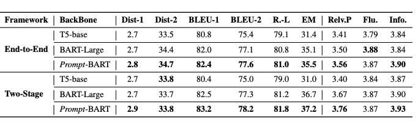

# Penguin: A benchmack for Natural Response Generation in Chinese Chinese Reading Comprehension

[**Dataset**](#dataset) | [**Checkpoints**](#Checkpoints) |
[**Paper**](https://arxiv.org/abs/2302.08817) | [**Evaluation**](#Evaluation) | 
[**Citation**](#citation) | [**License**](#license)

This repository contains resources for accessing the official benchmarks, codes and checkpoints of the paper:  [***Natural Response Generation for Chinese Reading Comprehension***](https://arxiv.org/abs/2302.08817).

**The paper was accepted by EMNLP 2023!** 🎉

We introduce Penguin, an end-to-end Chinese question answering dataset comprising of 200K question-passage-answer-response pairs. The goal of this dataset is to provide a challenging benchmark for end-to-end Chinese Machine Readinng Comprehension that includes the well-informed responses of each question. 
Penguin can facilate the research to build generative QA models in Chinese and provide a relatively large-scale training corpus for Chinese communities.
Please refer to our paper for more details.


## DataSet
Penguin, in the hopes of creating sophisticated  GRC models that can generate natural responses for practical QA situations. Considering constructing such a  dataset on a large scale is non-trivial, we initialize our dataset  from the current Chinese MRC dataset corpus to get raw passage-question-answer  triplets, including CMRC 2018, DuReader, and ReCo.

It is extremely difficult and expensive to ask the annotator to start from scratch and write a response $\mathcal{R}$ that makes sense and sounds natural for each < $\mathcal{P}$, $\mathcal{Q}$, $\mathcal{A}$ > triplet.
Therefore, we  generate informative and fluent responses via the following steps: (1) We first utilize a specific response generative model to generate initial responses for the above triplets; (2) Then, we use state-of-the-art semantic matching models alongside certain manually-created criteria to exclude samples of incoherence and semantic shift; (3) Last, we employ three professional annotators to rewrite and recheck undesired cases, therefore regulating data quality. As a result, we collect a sequence of 4-tuples: < $\mathcal{P}$, $\mathcal{Q}$, $\mathcal{A}$, $\mathcal{R}$ > in Penguin, where $\mathcal{R}$ is the labeled response. 

Concretely, we store our dataset in json files:


```
{
  "Passage": "鳊鱼一直备受人们喜爱，鳊鱼的传统做法是清蒸或者红烧。当然不排除可以烧汤，但是鉴于鳊鱼的肉质特色，不是很适合烧汤的",
  "Query": "鳊鱼可以炖汤吗?",
  "Answer": "可以",
  "Response": "鳊鱼可以用来煮汤，但是一般不推荐这么做."
  
}
```

### Download

| [**Train set**](https://hkustgz-my.sharepoint.com/:u:/g/personal/nchen022_connect_hkust-gz_edu_cn/Eap8XkQG5vtLqSMUu_hl_KYB6HVKLL8pE9Btai0a42tTZg?e=dEDxjM) |  [**Dev Set**](https://hkustgz-my.sharepoint.com/:u:/g/personal/nchen022_connect_hkust-gz_edu_cn/EUpD_pVCmoxCk6WJ1xrsbKoBe6FYsw_JkbhlyQg2uPVUJw?e=RnrZRP) | [**Test Set**](https://hkustgz-my.sharepoint.com/:u:/g/personal/nchen022_connect_hkust-gz_edu_cn/Efk3gpSyEqVAn8Ht9ILrnWkBwJQ1S8qjIs3Ss9naa34wuw?e=3tCjUi) | [**ALL**](https://hkustgz-my.sharepoint.com/:f:/g/personal/nchen022_connect_hkust-gz_edu_cn/EppmIwPoQOtGk0FYUYVgr6QB-n4tDq6pSvD0sX0q9QJcOg?e=31vJlx) |


## Checkpoints

### Results
Here we report automatic and huaman evaluations results of four baselines in our paper.

 

### End-to-end ckpt Download

|Model |  Large| Base | 
| :----- | :-------------------:| :------------------: |
| T5 | [T5-base](https://hkustgz-my.sharepoint.com/:u:/g/personal/nchen022_connect_hkust-gz_edu_cn/EcPEH2XnnqJNhHL5z45kmAwB01xEk0S0x6EErKHUvu5i-g?e=WqD00C)  | [T5-small](https://hkustgz-my.sharepoint.com/:u:/g/personal/nchen022_connect_hkust-gz_edu_cn/EcPEH2XnnqJNhHL5z45kmAwB01xEk0S0x6EErKHUvu5i-g?e=WqD00C) | 
| BART | [BART-Large](https://hkustgz-my.sharepoint.com/:u:/g/personal/nchen022_connect_hkust-gz_edu_cn/EcPEH2XnnqJNhHL5z45kmAwB01xEk0S0x6EErKHUvu5i-g?e=WqD00C)  | [BART-base](https://hkustgz-my.sharepoint.com/:u:/g/personal/nchen022_connect_hkust-gz_edu_cn/EcPEH2XnnqJNhHL5z45kmAwB01xEk0S0x6EErKHUvu5i-g?e=WqD00C) | 
| Prompt-BART | [Prompt-BART-Large](https://hkustgz-my.sharepoint.com/:f:/g/personal/nchen022_connect_hkust-gz_edu_cn/EjrfcimBm01EnQUUdqkntfQB7Ox9FDaB9JvsfC9GC4N88w?e=trpxZd)  | -| 

### Two stage ckpt Download
|Model |  Large| Base | 
| :----- | :-------------------:| :------------------: |
| T5 |[Answerer](https://hkustgz-my.sharepoint.com/:u:/g/personal/nchen022_connect_hkust-gz_edu_cn/EcvD0PcGxrBMnkgUGcnyKmUBPHzsiPAhG7cEvA-ZLNGgpA?e=srfs5y), [Responser](https://hkustgz-my.sharepoint.com/:u:/g/personal/nchen022_connect_hkust-gz_edu_cn/ETW6IluL6UtHo1h274x4EvYB_dk3rblOemUgav37eL5_hQ?e=bcvORF)  | [Answerer](https://hkustgz-my.sharepoint.com/:u:/g/personal/nchen022_connect_hkust-gz_edu_cn/EcvD0PcGxrBMnkgUGcnyKmUBPHzsiPAhG7cEvA-ZLNGgpA?e=srfs5y), [Responser](https://hkustgz-my.sharepoint.com/:u:/g/personal/nchen022_connect_hkust-gz_edu_cn/ETW6IluL6UtHo1h274x4EvYB_dk3rblOemUgav37eL5_hQ?e=bcvORF) | 
| BART | [Answerer](https://hkustgz-my.sharepoint.com/:u:/g/personal/nchen022_connect_hkust-gz_edu_cn/EcvD0PcGxrBMnkgUGcnyKmUBPHzsiPAhG7cEvA-ZLNGgpA?e=srfs5y), [Responser](https://hkustgz-my.sharepoint.com/:u:/g/personal/nchen022_connect_hkust-gz_edu_cn/ETW6IluL6UtHo1h274x4EvYB_dk3rblOemUgav37eL5_hQ?e=bcvORF)  | [Answerer](https://hkustgz-my.sharepoint.com/:u:/g/personal/nchen022_connect_hkust-gz_edu_cn/EcvD0PcGxrBMnkgUGcnyKmUBPHzsiPAhG7cEvA-ZLNGgpA?e=srfs5y), [Responser](https://hkustgz-my.sharepoint.com/:u:/g/personal/nchen022_connect_hkust-gz_edu_cn/ETW6IluL6UtHo1h274x4EvYB_dk3rblOemUgav37eL5_hQ?e=bcvORF) | 
| Prompt-BART | [Answerer](https://hkustgz-my.sharepoint.com/:u:/g/personal/nchen022_connect_hkust-gz_edu_cn/EaXUFwRe9fZBsQr92jiObL8BlZ04bSKqMzSFxkXjCv9x1Q?e=QtLTQi), [Responser](https://hkustgz-my.sharepoint.com/:u:/g/personal/nchen022_connect_hkust-gz_edu_cn/EVQyZwn9ERdOqVGJ7MCJohEBtU5RBr5foLap1xzj8VK71w?e=lwy1rp)  | -| 

## Evaluation

### inference 
We provide the inference code, please refer to utils/inference.py.
```
python3 utils/inference.py
```
 Of note, you should change the model_path based on your local enviroment. Then it can generate  responses from models and store in generate.json.
 
### Compute metrics
```
python3 utils/inference.py generate.json
```
Running this script could lead to computing the automatic metrics of the model and store in results.csv file.


## Citation

```
@inproceedings{Chen2023NaturalRG,
  title={Natural Response Generation for Chinese Reading Comprehension},
  author={Nuo Chen and Hongguang Li and Yinan Bao and Baoyuan Wang and Jia Li},
  year={2023}
}
```
